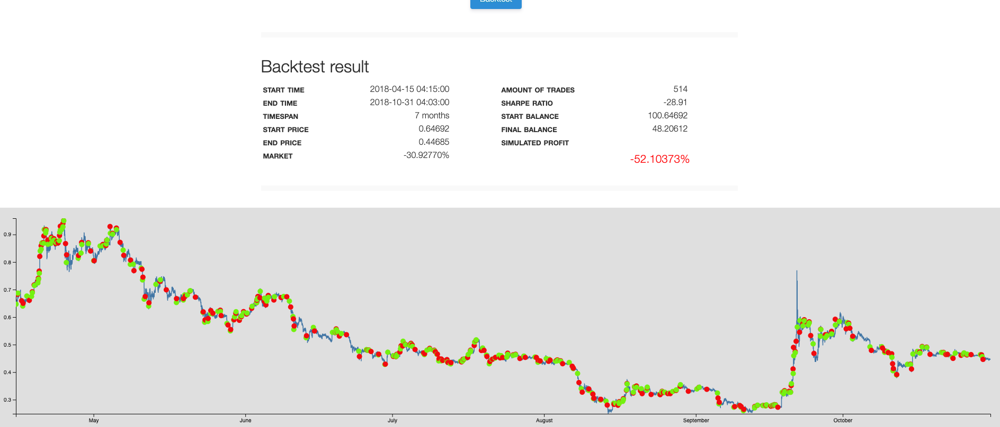

### RSI BULL BEAR ADX TEST

reference:

https://forum.gekko.wizb.it/thread-100.html

source code:

https://github.com/tommiehansen/gekko_tools

test 1 result:


```
[SMA]
long = 1000
short = 50

[BULL]
rsi = 10
high = 80
low = 60
mod_high = 5
mod_low = -5

[BEAR]
rsi = 15
high = 50
low = 20
mod_high = 15
mod_low  = -5

[ADX]
adx = 3
high = 70
```