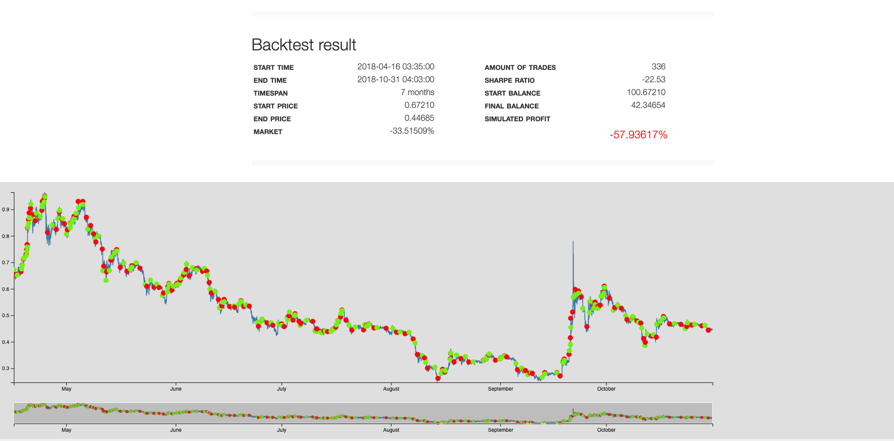
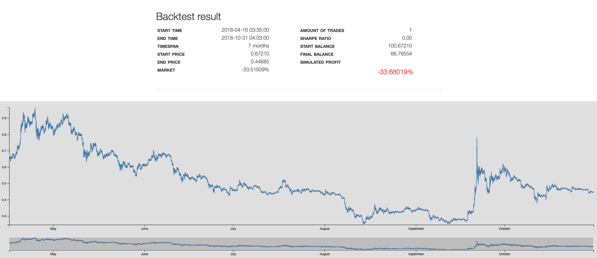

### RSI BULL BEAR ADX CANDLE BATCHER TEST

reference link:

https://forum.gekko.wizb.it/thread-57778.html

source code:

https://github.com/R4nd0/Gekko-Strategies.git


result one:




parameter one:
```
# SMA INDICATOR
SMA_long = 250
SMA_short = 55
SMA_Timeframe = 10

# RSI BULL / BEAR
BULL_RSI = 9
BULL_RSI_high = 82
BULL_RSI_low = 60
BULL_RSI_Timeframe = 10

BEAR_RSI = 12.5
BEAR_RSI_high = 60
BEAR_RSI_low = 15
BEAR_RSI_Timeframe = 10

# MODIFY RSI (depending on ADX)
BULL_MOD_high = 5
BULL_MOD_low = -5
BEAR_MOD_high = 5
BEAR_MOD_low = -5

# ADX
ADX = 3
ADX_high = 50
ADX_low = 40
ADX_Timeframe = 10

# Stop Loss & Gain
Stop_Loss_Percent = 25
Stop_Gain_Percent = 30

#Minimum Short SPREAD Percentage (won't sell if less than x%)
Min_Loss_Percent = 0.5

```
test 2:


### <span style="color:red">Roundtrips</span>
### <span style="color:red"> Not enough data to display</span>


parameter 2:
```
# SMA INDICATOR
SMA_long = 1000
SMA_short = 50
SMA_Timeframe = 10

# RSI BULL / BEAR
BULL_RSI = 10
BULL_RSI_high = 80
BULL_RSI_low = 45
BULL_RSI_Timeframe = 10

BEAR_RSI = 15
BEAR_RSI_high = 50
BEAR_RSI_low = 20
BEAR_RSI_Timeframe = 10

# MODIFY RSI (depending on ADX)
BULL_MOD_high = 5
BULL_MOD_low = -5
BEAR_MOD_high = 15
BEAR_MOD_low = -5

# ADX
ADX = 3
ADX_high = 70
ADX_low = 50
ADX_Timeframe = 10
```